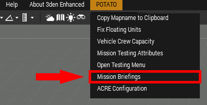

# Finalizing Your Mission

In order to add briefings to your mission, the menu can be found under POTATO > Mission Briefings inside the editor.

<figure><figcaption><p>Mission Briefings!</p></figcaption></figure>

In order to change map conditions such as weather and time of day, you can do so in the Intel menu.


Also through this menu you can change what phase the moon is in. This gives you control over how dark your nights are. Light levels at night are also effected by the overcast setting.


To change the mission description that is visible during slotting, go to Attributes -> Multiplayer -> Summary. Whatever you type into this box will be visible during slotting. This is typically where you'd put a quick blurb about the mission. It can be as simple as “Marines eliminate Insurgents”. That’s all that’s required from a description, but feel free to include any other important (and relevant) information such as required assets or weird quirks. If you don’t specify a slot as required then be aware that leadership may not take it.

 

The Summary text field is also where you set up your ratio for a TvT. If the first thing in this text field is a valid ratio, it will automatically be set up on the slotting screen. However if any text is placed before the ratio in the description, the ratio will not display properly.

The ratio format will always go in the order Blufor:Opfor:Independent. Also in the ratio, if you put the letter C next to a number, then that team’s number will be a constant. For example, in the ratio 4C:2:1, Blufor will have 4 members, and Opfor will have a 2 to 1 advantage over Independent.

A fully completed summary for a TvT may look as such:


```
3:2 || US Marines hunt down an Insurgent cache. || BLUFOR: 2x MMG [OPT] || OPFOR: 1x IFV [REQ]
```


The description.ext file is located in the root of your mission folder. Open it up and change: onLoadName= “Mission Name Here”;.&#x20;

To change the name of your mission on the loading screen go to your mission folder and open up the file description.ext in any text editor. In there you will find this line:

onLoadName = "\*\*\* Insert mission name here. \*\*\*";

Simple replace the text inside the quotation marks with the name of your mission. Just include the actual mission title here, not the whole Author\_Type\_Title\_version.map.


