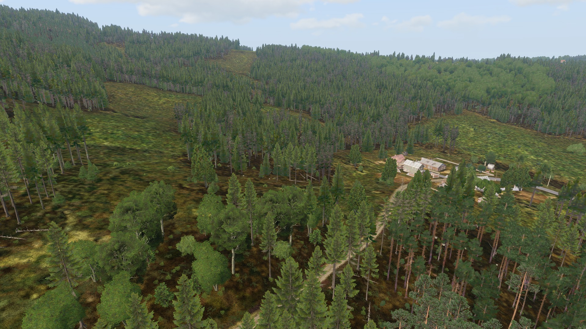
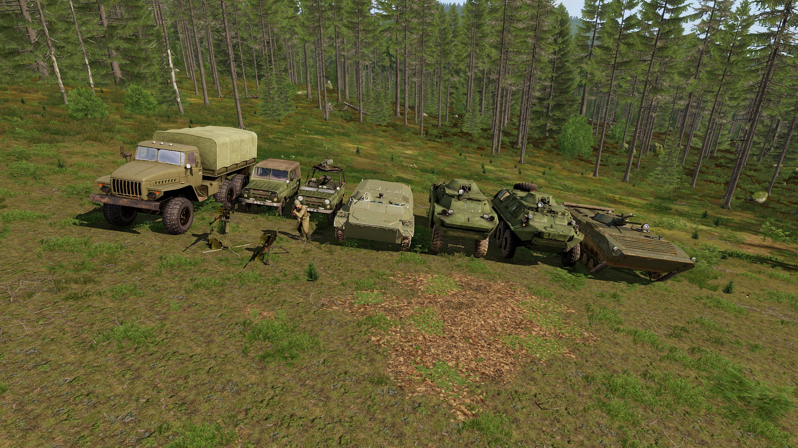

# Force Composition and Terrain

So, you just got the BWMF working properly on your machine. You're excited to create a new mission, and you load up and start flying through the editor looking for cool places to fight in. But wait, the whole map has so many different places and the mission file has so many assets for you to use! How could you possibly choose which assets to bring into the mission?

One of the first considerations in making a mission is what sort of AO the mission will take place in. Here is a guide for new mission makers on what sort of forces you should throw at the players for a fun time.

**Preface:**

For the sake of simplicity and illustration, let us presume that we'll be fighting CWR3 Soviet forces on the Chernarus 2020 map. The map has all common terrain types that we'll encounter during session, and the Soviets have a full equipment roster we can utilize.

**Forests:**

<figure><figcaption>
A beautiful forest, awaiting dead Soviets
</figcaption></figure>

We'll start with forests, because they are one of the easier terrains to Zeus for. Sightlines are partially obscured, and there are limited threats you can employ against players, which means less special enemy assets you have to worry about.

For forests:

* **Infantry squads are the most mobile and flexible enemy threat you can leverage against the players.** The large amount of cover (trees, rocks, dead trunks,...) within the forest provide both the players and enemy with cover, leading to more dynamic gunfights.
* **Static emplacements provide a much greater threat at the cost of not being mobile.** Use emplacements wisely with some improvised defenses, and you'd be surprised how engaged the players will be with a couple of enemy fireteams shooting at them as well.
* **Technicals and guntrucks patrolling main roads and supply routes would break up the monotony of fighting against infantry.** Order them to patrol roads and tracks that cross the players' route, to provide another threat squads will have to deal with.
* **Wheeled APCs and **_**very light**_** IFVs would be great to provide a much greater threat for the platoon and/or company to deal with.** The mounted infantry can be dismounted to further harass the players, and the autocannons and machine guns these vehicles bring with them will definitely give infantry players a good scare.

An appropriate motor pool for this AO would look like this:

<figure><figcaption>
An example of what the players could feasibly face
</figcaption></figure>

As for the player force:

* **Standard infantry squads are good enough to face most threats you can expect to encounter in the forest.** While it is tempting to give players heavier assets to play with, with forests being vehicle adverse as is, the only assets you'll be able to effectively use are the ones carried on infantry backs.
* **If you want your squads to be more mobile, transport trucks and MRAPs would be sufficient for your purposes to move along roads that run through forests.** Again, AO considerations might change this, and you might find that your players would like it better if they walked instead.
* **If you really want IFVs, give them a platform that is not too heavy.** The enemy cannot bring their big guns to the fight, so why should you? A vehicle with an autocannon and some sort of guided missile would be sufficient to face against everything the enemy could throw towards you.

_(to be continued, this is a template/ draft)_
