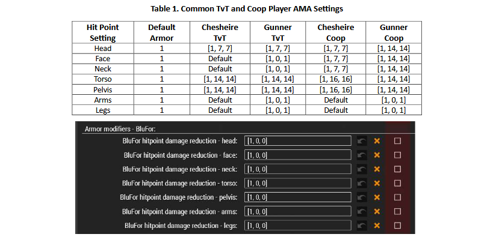
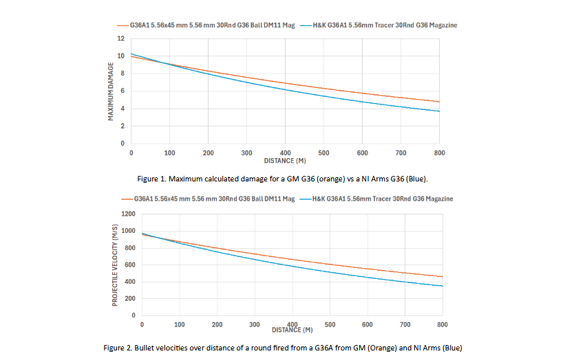

# POTATO Armor Modifier - ACE

## Armor Modifier - ACE: Usage and Damage Model 

### Quick Reference 

This section is just if you want to get started using POTATO AMA quickly, or need a quick refresher on tried and true settings.

<figure><figcaption>
Figure 1. AMA Blufor Default Settings
</figcaption></figure>

### Introduction

Bourbon Warfare (BW) has recently adopted Armor Adjuster – ACE (AMA) over ACE Armor Adjuster (AAA) due to locality issues with the latter. AAA was both obtuse and unintuitive, requiring some trial and error or previous knowledge to adjust armor values across different mods. While AMA is theoretically more straightforward, the options provided obfuscate any improvement, leaving mission makers (MMs) with more options and confusion than before. This document aims to help alleviate the issue by introducing parts of the Arma damage and then finishing by introducing and providing standard AMA settings.

### Understanding the Arma Damage Model

This section covers topics regarding Arma’s damage model. First, bullet damage and some related calculations are introduced. Then, armor’s effect on damage dealt to a hit point, and some typical values for armor are presented.

#### Bullet Damage

Bullets in Arma inflict damage based on a few different factors, but for non-explosive rounds (bullets), the damage is calculated by the bullet’s configured “hit” value and the ratio of the change in speed a hit causes over the configured “typical speed.” Specifically,

<figure><figcaption>
This is ignoring RHS values which provide more damage for 5.45x39mm and 7.62x39mm rounds. CUP, GM, and HLC/NI Arms
</figcaption></figure>

where damage is the damage done by the projectile (bullet), hit is the configured “hit” value, change in speed is the change in speed of the projectile as the result of hitting an object, and typical speed is a value configured per projectile type. The ratio of change in speed over typical speed is limited to be between zero and two. Most small arms bullets have hit values ranging from 7 to 12, with 5.56x45mm mostly falling between 9 and 10.5, 5.45x39mm between 8 and 9.5, and 7.62x39mm between 9 and 11, with some heavier rounds hitting at 151. In addition, because a bullet’s damage changes proportionally to speed, a bullet will do more damage to a target closer than farther away. The differences in drag, muzzle velocity, and other parameters complicate the comparison of damage done by rounds as some lose velocity faster than others.

If we assume a bullet stops upon impact, we can calculate the damage vs distance for a bullet. For example, GM and NI Arms both have a G36A1 that we compare in Figure 2 below. From Figure 2, it is clear that for what should be the same round and gun, the NI Arms simulation of a G36A1 has a higher initial damage potential, but because it slows more quickly than GM’s model, the NI Arms bullet has a lower damage potential past 100 meters, see Figure 2. For a standard engagement at 100 to 200 meters, this gives damage values for both that sit somewhere between eight and nine. Similar results can be found comparing other rounds and weapons available in the BW mod set. Generally, most rounds do somewhere between seven and fourteen damage on hit. Those values may seem high for those familiar with SQF commands like “setDamage” and “getHitPointDamage,” and their zero-to-one scale for damage. As the next section illustrates, the Arma damage model uses armor values to diminish the initial damage values to be closer to or within that zero-to-one range.

<figure><figcaption>
Figure 2. Bullet velocities over distance of a round fired from a G36A from GM (Orange) and NI Arms (Blue)
</figcaption></figure>

#### Armor Values

Armor values make up the second significant portion of the Arma damage model. Damage for infantry in Arma is done in two ways: to the overall structure of a unit and to specific regions of a unit called hit points. These hit points include regions like the neck, individual arms, and face. In addition, the torso is broken down into the chest, diaphragm, abdomen, and pelvis hit points. The structural damage is less important when using ACE Medical, so we will ignore it. When a round hits a hit point, the damage the bullet can do is calculated using equation (1). The damage the bullet can do is then divided by the hit point’s armor, and that new damage is added to the hit point damage. For example, if a unit is hit in the chest hit point with a bullet that deals a damage of 10 and the hit point armor is 20, then the hit point would take 0.5 damage instead of the full 10. ACE Medical then uses the resulting damage to create wounds and bruises.

A hit point’s armor is the sum of all armor values that protect that hit point. For infantry, armor protection comes from a unit’s vest and the unit’s intrinsic armor value. Vest armor ranges in value from zero to well over 30, with most of CUP’s vests using a chest armor of 16. It is worth noting that most vests do not add armor to the pelvis hit point. A unit’s intrinsic armor is based on what unit is placed. Potato units have an armor of one on all hit points. Most vanilla units have torso armor values between two and four and limb armor values of six.

### Using Armor Modifier - ACE

Armor Modifier - ACE (AMA) allows a Mission Maker (MM) to force the armor value for hit points to be within a range. Limiting armor values is done in the CBA settings “Potato – Armor Modifier ACE” menu, where armor values can be set per side (Opfor/Blufor/Independent/Civilian), Figure 3 below. Each hit point allows the setting to be changed for three values given as an array. In order, those values are:

* Damage Divider – a straight divider to damage to a hit point. This also treats the bullet as if it did less damage, affecting how ACE Medical adds bruises. The default value is one, and the allowed range is one to infinity.
* Armor Minimum – the minimum armor a hit point is simulated as having. Any armor value below this will be brought up to the minimum, while this setting does not affect values above the minimum. Values below one result in no minimum armor constraint.
* Armor Maximum – the maximum armor a hit point is simulated as having. Any armor value above this will be brought down to the maximum, while this setting does not affect values below the maximum. Values below one result in no maximum armor constraint.

While the first setting for each hit point is generally left untouched, the second two can be used to bracket armor values or force armor to a specific value. For example, an array of \[1, 16, 16] would make a hit point behave as if it had an armor of 16. Some common values are given in Table 1 below.

<figure><figcaption>
Table 1. Common TvT and Coop Player AMA Settings
</figcaption></figure>

### Summary

This document introduces a short overview of Arma 3’s infantry damage system by explaining how damage from a bullet is calculated and how armor affects the damage a bullet can do. We also introduced how AMA allows a mission maker to change armor values by changing a damage divider, minimum, and maximum armor values for each hit point. While some of the damage model information was brief, it should provide enough information for an MM to set AMA settings to their liking or change them if issues arise.
