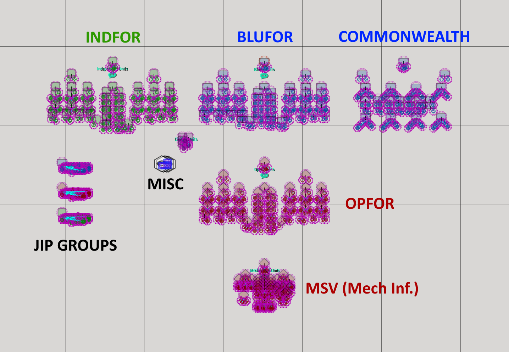

# Steps to Create a TvT

Now that we have the mission folder set up and we've gone over loadouts, now it’s time to actually make the mission! Let’s take a closer look at what we have available to us:

<figure><figcaption>
BWMF Orbats
</figcaption></figure>

In the editor as seen above there are:

1. Blufor Units (Secondary type of BluFor units: Commonwealth)
2. Independent Units
3. Opfor Units
4. MSV units (Inherits loadout from OpFor)
5. Civilians
6. potato/spectate modules (misc)

You are free to delete anything, <mark style="color:red;">**EXCEPT**</mark> for the potato or spectate modules (misc).

Blufor/Indy/Opfor will have COY, both platoons, 4 transport helos, 4 IFVs, WSL, 2 MMGs, 2 MATs, Mortar, MSAM, Sniper team, Engineers, AH, Tank team, and JIP. Commonwealth squads are similar to MSV, but 1 squad per PLT will be a weapons squad with MAT and MMG integrated.

From here it’s time to trim the fat. Meaning, delete unused slots (like helicopter and IFV slots if your mission will not be using them). Also, remove unused factions such as Civilians and MSV (or more) if your mission will not be using them.

From here the guide will go over things that are considered necessary when making a mission. It will not go over how to use everything in the editor. Check out [here for some more info.](https://community.bistudio.com/wiki/Eden\_Editor)

## Balancing Your Mission

Balance is subjective. There’s no avoiding it. But from a mission making standpoint you want to try and eliminate as much subjectivity as possible. It’s also important to consider whether or not something is fun. It’s why we don’t use large HE loadouts for vehicles very often. We could, but to balance it out the team using them would need to be severely nerfed. And the ratio would need to be skewed, to the point where lots of people might die to HE rounds and it wouldn’t be a lot of fun for those people.

Here are some ways to balance a mission:

* Terrain
* Ratio
* Assets
* Gear (armor vs no armor, optics)
* Radio distribution
* Map markers

The first 3 bullets are the primary ways a mission is balanced and I recommend sticking to those three for most of your missions. When you get more comfortable with balancing a mission you can try experimenting with the other stuff.

### Terrain

Are the defenders in a bowl? Do the attackers only have one avenue of approach? Does your choice of an AO have issues? Is there nothing but open ground with no cover? These are the kind of questions you will want to ask yourself when considering the terrain. Adjust assets, loadouts, and ratio as needed if terrain balance is a concern. Or, you may want to find a different area of the map for the AO.

### Ratio

If the mission is attack:defend then attackers need to always have some advantage over the defenders. The concept of having to advance into a waiting enemy justifies it. This ratio is forefront when it comes to balance consideration. Ratio for TvTs is typically 3:2 Attackers:Defenders, but depending on player count and other factors 4:3 and 5:4 may be acceptable.

### Assets

This can include anything from MMG teams to a vehicle crew. They will act as a force multiplier. It’s also important to not overestimate how much of a force multiplier an asset could be. For example, an MMG team would not excel in fast-paced close encounters, so it would not be wise to consider it a big force multiplier for a team to take one. Generally with vehicles you will want to make sure the other team has some form of counter so that they can deal with it.

### Gear

Magnified optics and suppressors are big ones. Vest armor is also worth considering. Night vision versus no night vision (depends on map brightness... _although not recommended due to how different player hardware affects this drastically_). Reduced or bolstered grenade count. Vest armor is not consistent across mods, so your best bet is to test thoroughly - ACE Armor Adjuster and POTATO ammunition may help as well. During your own testing of the mission, make sure to test both sides' armor.

### Radio Distribution

A close cousin of gear, it merits its own mention due to the implications involved if you decide to have reduced radios. Don’t overdo missions with reduced radios; however, if carefully considered, having reduced radios could add an interesting dynamic to a mission’s flow.

### Map Markers

No/reduced map markers can be a lot like reduced radios. It can be used in a way that’s interesting, but most of the time the way it plays out isn’t always great. Same recommendation comes for not overdoing missions without map markers: using sparingly, and don’t reduce map markers or radios unless you are confident in how you are designing your mission.

## Design

Set up your AO in the way that you want. I recommend defining borders, but it’s not a requirement and it varies mission-by-mission. You can use the “Cover Map” module (on the right bar, Systems > Modules > Other > Cover Map) or draw borders by going to Markers > Areas > and then pick a shape. Basically, you want somebody to open their map and be able to quickly get an idea of how the mission might play.

<figure><figcaption>
Pretty small... but doable.
</figcaption></figure>

Another design consideration here is scope. If you are making a lower player count TVT then I suggest keeping the AO a bit smaller, or making a symmetrical 1:1 TVT. This helps keep things more focused for a second TvT, which will typically have a smaller player count due to it being later in the night. If you have an AO too large for the player count then you could end up with players spending a significant amount of time just walking.

## Briefings

In the editor, go up to the top hotbar and on the right, find POTATO -> Mission Briefings. The situation tab is typically fluff text, or some sort of story arc. You can put anything in here really, but do not assume everyone will read your situation tab.

The mission tab should be concise about the objectives and any other mission critical information. Just a quick sentence or two per item, nothing more.

The administration tab should hold any information that you, as the mission maker, want to convey to the people playing your mission. In particular, leadership will look to this section for further clarification. The administration tab may also contain rules that must be followed. This is where total mission time (plus safe start time) goes as well. Other examples would be telling players who on their team has DEMO, if RATs have extra AT, if there are limitations on how attackers can enter the AO, and other similar information.

Note: use shift-enter to skip to a new line in the briefing menu

You can also assign individual unit or group briefings. Open the attributes menu for a unit and scroll down to Object: POTATO: Unit Briefing. For groups, open a group’s attributes, and go to Composition: POTATO: Group Briefing.
