# 📖 Recruit Handbook

<div data-full-width="false">

<figure><figcaption></figcaption></figure>

</div>

<figure>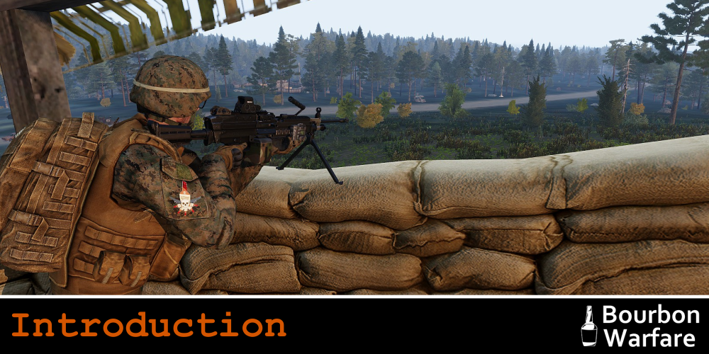<figcaption></figcaption></figure>

Thank you for showing interest in joining our BW family. This guide is your one stop shop for all information regarding the recruitment process, sessions, the community, and configuring your mods. You might find yourself referring back to this document regularly, so we recommend bookmarking it for easy access.


<figure>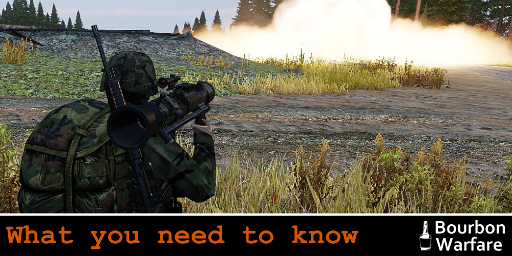<figcaption></figcaption></figure>

### Bourbon Warfare Overview

Bourbon Warfare started in late 2013. We focus on getting as many like-minded people playing the game that we love, in a manner that has just a pinch of structure and no more than the required amount of seriousness. We play the game because we enjoy the game, not because we wish to emulate a branch of the armed forces.

We have 3 main platforms that we communicate on. Discord is used for the majority of our unit's communication, and where day to day chat is located. The forum is used for administrative and structured conversations that go on around making our sessions better, as well as mission testing.&#x20;

Finally, we have a Teamspeak server which we use for all of our VOIP services in-game. Information for connecting to these servers can be found in the “Meet the Group” section.

We run 2 sessions a week, Wednesday and Sunday at 1900 CST. For those who need help with the conversion:

.png>)

Sessions typically run for about 3 hours. We typically play three missions, one PvP (also known as TvT) and one PvE (also known as Coops), and one After Hours mission. This way we get to shoot both at and with our friends. We find that this strikes a balance for those who have a preference one way or another.

For sessions we run a custom modpack. We try to change things up in the modpack every now and then to make sure that things stay fresh, and members can recommend adding mods on the discord. Thanks to our time playing ARMA and making many friends, we are blessed with contacts within the community that often mean we get to play with things that others don’t.

***

**The APEX, Contact and SOG: Prairie Fire DLCs are required to 100% participate in our sessions.**

The DLC is not required to join BW. However, APEX, Contact and SOG add many new objects, equipment, Tanoa, Livonia and the SOG maps to our arsenal. Mission-makers are free to use whatever assets are available to them in the editor, so if a mission uses DLC maps, you will not be able to play because the mission will not let you join. We do allow and encourage the use of the the SOG compatability data so that you can join missions on other maps that use the assets - however you won't be able to drive or use the Gunner seats in DLC vehicles, and using the gear will give you popup ads. Often, mission makers will provide alternate gear or vehicles so that the slots are accessible to everyone, or will label the slots accordingly. \
You are free to wait until the next mission, but there is no guarantee you will not have the same problem the next mission.

***

We don’t enforce any sort of attendance or training, other than your initial orientation, though this is generally for your benefit. Members are free to come and go from session as they please. Need to take a break for a couple weeks as IRL responsibilities mount up? We understand and look forward to seeing you at the next session you are able to attend.

There are also semi-regular off night events hosted by our members. These events can range anywhere from Stellaris campaigns or a few rounds of Golf With Your Friends, to a more serious pen and paper RPG night. Though ARMA is our focus, it is far from the only game that we play.

If all of this sounds like something that you want to be a part of then we should move onto the next section: your application.

<figure>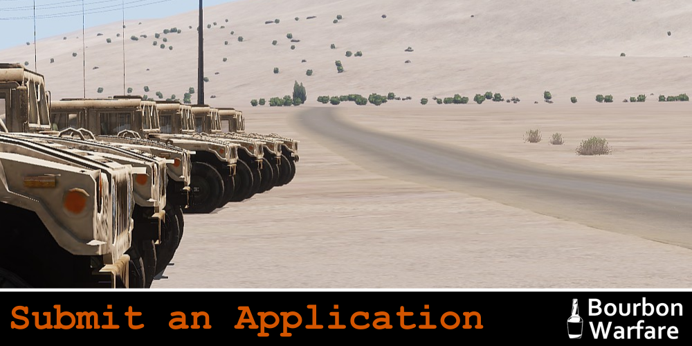<figcaption></figcaption></figure>

<details>

<summary>Submit an Application</summary>

First step in joining BW is to submit an application. A [link to the form can be found here](https://docs.google.com/forms/d/e/1FAIpQLSc08B6B\_aW8yUytB9J419iuWs9g7vWwMgNEdIdaDjRvxLvLSQ/viewform?embedded=true).

Let us know why you want to join. Tell us a little about yourself and what you might offer. This isn’t a job interview, we don’t discriminate. But it is a chance for us to get excited to meet you.

We ask that you include a link to your steam profile. This is done more to safeguard us as a community. We don’t want spam bots and CSGO knife traders joining the forums simply for the sake of spamming us with stuff that we aren’t interested in.

Once an application has been submitted, you can create a forum account. Strictly speaking, it doesn’t matter what order you do these first 2 steps but for the sake of argument let's continue.

[https://forums.bourbonwarfare.com/index.php](https://forums.bourbonwarfare.com/index.php)

With that done, it's time to meet the gang.

</details>

<figure>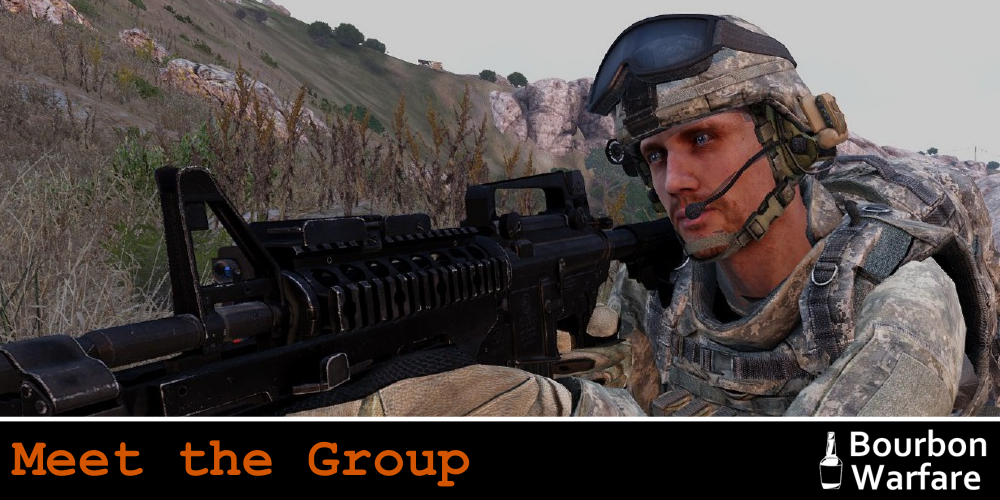<figcaption></figcaption></figure>

<details>

<summary>Meet the Group</summary>

So, it’s time to make introductions. First off, you will need to download TeamSpeak[^1] and Discord. Links below.

[TeamSpeak](https://files.teamspeak-services.com/releases/client/3.6.1/TeamSpeak3-Client-win64-3.6.1.exe)

[Discord](https://discord.com/download)

Now that you have the software installed, we need to get you into our servers. Follow the instructions below for each.

_Please make sure that your name across all platforms are the same. This includes the TeamSpeak, Discord, and the forum. It makes getting to know you a hell of a lot easier._

***

**Discord**

[https://dsc.gg/bourbonwarfare](https://dsc.gg/bourbonwarfare)\
Once you have connected to the Discord server react to the bot post in `#welcome-landing`. From here, the robots take over. They will announce that you have arrived and let those who need to know that you are in need of a welcoming party. It will also give you your Recruit tags in Discord and open up a few channels for you to get to meet some of the other Recruits and the Members. Make sure and visit the `#recruit-help` channel if you need any help with anything.\
\
In Discord you will also be able to sign up for roles in the `#roles` channel. Just react to whatever role you want to be added to, and head to the `#lfg` channel after you’ve grabbed some roles if you’d like to find some others to play a game with.\
\
If you’re having issues, feel free to reach out to any Member for help, most of them are well versed in the use of Discord.

***

**TeamSpeak**

`Domain: ts3.bourbonwarfare.com`\
`IP: 104.128.50.152`\
`Port: 9988`\
\
The first time you connect to our TeamSpeak server, you might come up against the Security Authentication system. This is a one-time deal, just hit start and wait it out. \
\
Manual connection information is also located in the ["Connection Information"](connection-information.md) page here on the wiki for future reference

It’s best to add a bookmark in TS, as it is likely that you will be connecting regularly.\
\
Note that "Push to Talk" is set by default in our Teamspeak, however if you are more comfortable with "Voice Activation" feel free to request that permission. An important consideration, though, is that if we find that your background noise is too disruptive, we may force "Push to Talk" upon you. Make sure your background is relatively quiet, or use AI noise suppression software.\
\
Finally don’t be shy! Say hello! We don’t bite, at least not usually. :relaxed:

</details>

<figure>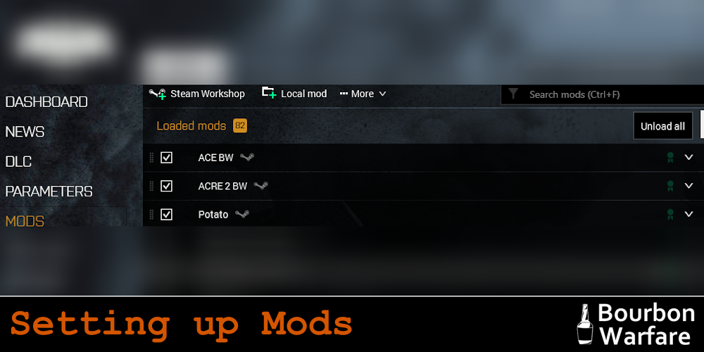<figcaption></figcaption></figure>

<details>

<summary>Setting Up The Mods</summary>

Mods are what make ARMA great. If you have only played vanilla ARMA up to this point, then you have been missing out. There is a whole world of possibilities in modding that will completely change how you play the game. Our modpack is custom-built to bring all the best parts of ARMA together so that we can play the game in a way that makes the multiplayer experience the best it can be.

We use the Vanilla ARMA 3 Launcher for our mods, utilizing the Steam Workshop and .html files to download the mods.&#x20;

***

1.) First, download the most current modlist HTML from the following link:

[https://mods.bourbonwarfare.com/](https://mods.bourbonwarfare.com/)

2.) Then, open your Arma 3 Launcher and navigate to your MODS tab.

3.) Under the "More" tab, click on the "Import list of mods from a file...".

4.) Select the modlist.html and click "open".

5.) Then navigate to the DLC tab and ensure that the S.O.G. Prairie Fire DLC is selected.

6.) Run ARMA once, without TeamSpeak open. ACRE will prompt you to install the latest TeamSpeak plugin. Allow this, then open TeamSpeak.

7.) Congratulations! You're ready to play. Follow the instructions on the Connection Information page to gain access to our server.

</details>

<figure>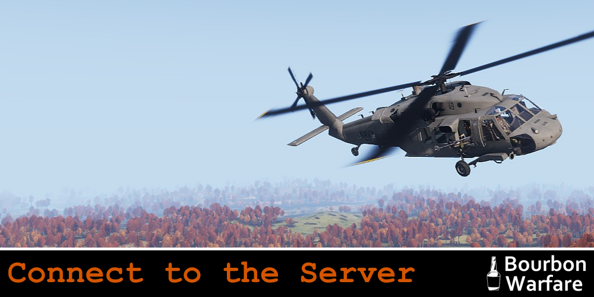<figcaption></figcaption></figure>

<details>

<summary>Connect to the Server</summary>

Also see: [connection-information.md](connection-information.md "mention")

```
Server Name - Bourbon Warfare - Main
Hostname - a3.bourbonwarfare.com
IP - 104.128.50.152
Port - 2303
Password - Ask a member or find the details in the ARMA 3 channel Description on TS
```

Once into the server, load a random mission and check that you get the following information in TeamSpeak in regards to your ACRE plugin working correctly. Note that you must be in the ARMA 3 channel for this to work.

Click to enlarge:

.png>)

With all of that out of the way, you are ready for your orientation! But first: a little bit of information regarding the Recruit Phase.

</details>

<figure>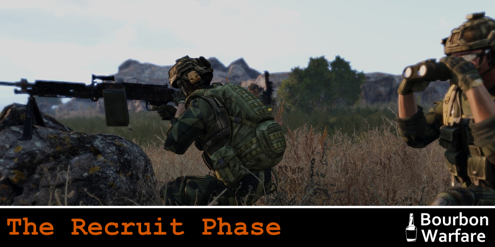<figcaption></figcaption></figure>

<details>

<summary>The Recruit Phase</summary>

So, you have your Recruit tags in TS, Discord and the forum, and your mods are all set up. That’s a start, but what's next?&#x20;

You have now entered your Recruit Phase with BW. Let's go over what you need to know about being a Recruit.

1. Orientation: It is important that you organize this as quickly as possible so that you can get in game and start having fun. Proceed to the `#recruit-help`channel in Discord to schedule an Orientation - use the `/orientation` command. It ultimately is your responsibility to make sure that this happens in a timely manner.&#x20;
2. Once through Orientation, you will be ready for your first session. This is a chance to get to know everybody. It is also their chance to get to know you. These are the people who will make the decision as to whether or not you are to become a Member.&#x20;
3. You will have 4-6 sessions or around 2-3 weeks (if you attend concurrently), to make an impression, and at the end of it the Members vote to see if they all think that you are a good fit. **This is nothing to worry about:** We are voting on your ability to follow the rules and not be a dick, _not_ your ability to play the game or how popular you are among the members.
4. There will be some limitations in regard to the roles that you are able to take during your Recruit Phase. This will be gone over in detail during your Orientation. There are also some forums and discord channels that you are made available to you only when you become a Member.
5. Once the recruit phase is over you will receive a warm Bourbon welcome and be given your Member tags. Easy.

</details>

<figure>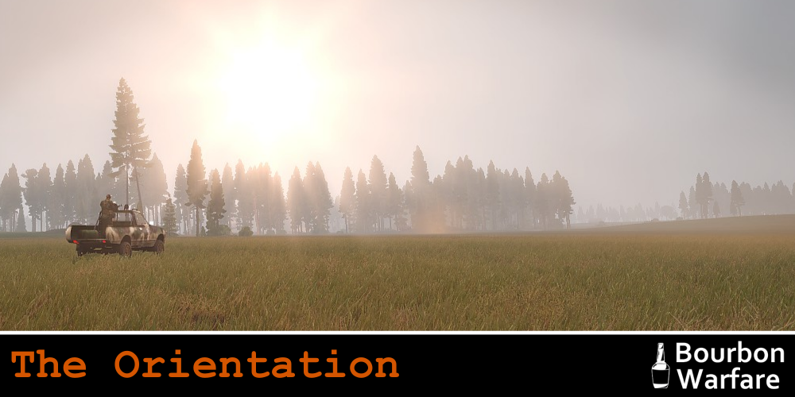<figcaption></figcaption></figure>

<details>

<summary>Orientation</summary>

Orientation is a chance to get you up to speed with our mod pack and the way that we play ARMA. It is generally 15 mins - 60 mins long depending on how well you know ARMA - if you're an old veteran to the game, it'll be short - if you're brand new, we can go as long as you need to feel comfortable!\
\
Everything that is gone over in the orientation is also documented elsewhere in the forums, so it’s not necessary to bring a pen and paper, but if you are the type to do that then by all means, go for it. There are no tests or required knowledge, this orientation is simply to ensure you have the base level of knowledge to enjoy our sessions.\
\
Here are a few things that you can expect to go over during your orientation (in no particular order).

* An explanation of BWs Rules and group ethos.
* Session times and how sessions are structured
* Slotting and the BW “company” structure, and joining in progress (JIP)
* The map screen and briefing
* General map reading skills
* Safe Start
* Leadership planning and briefing
* Contacting an Admin in-game if needed
* Radios
* ACE interact
* Medical
* Comms, contact reports and map marking
* Squad movement
* PID
* Spectator and Respawn

Don’t be afraid to ask questions. There is a lot of knowledge amassed within the group of people who carry out orientations. Even if you are an ARMA vet with 1000+ hours in game, you will still learn something in our custom systems and scripting.\
\
To schedule your Orientation head on over to the `#recruit-help` channel on Discord, and use the `/orientation`command in the chat. To make things easier on your potential Orientators, please include your availability as well (ie. "I'm available from 5pm EST to 7pm EST tonight and Friday!"). There are a number of members who are able to run Orientations, and they are generally just waiting for you to reach out to make it happen.

</details>

<figure>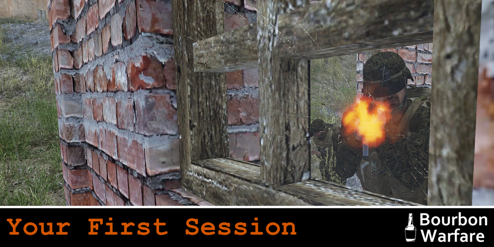<figcaption></figcaption></figure>

<details>

<summary>Your First Session</summary>

So with all of that out of the way, it is time to get into your first session. In general, it is preferable that this happens shortly after your Orientation. This way you have at least a fighting chance of remembering everything that you went over in the Orientation :laughing:

Please let your Orientator know when you plan on attending your first session so that we can organize your Drinking Buddy. Your Drinking Buddy (DB) is an experienced Member who will accompany you throughout your first session.&#x20;

They are there to answer your questions, help you with any technical issues, and make sure that you are able to focus on shooting pixels. Your DB will assign you your slots for your first session. This is important during slotting, so pay attention to who you have been assigned, and follow their lead.

Your DB is somebody is available to you not only in your first session but throughout your Recruit Phase. If you have questions at any point, DM them on Discord!\
\
If you wish, you may request a DB for any subsequent sessions, but it is only mandatory for the first.

</details>

<figure>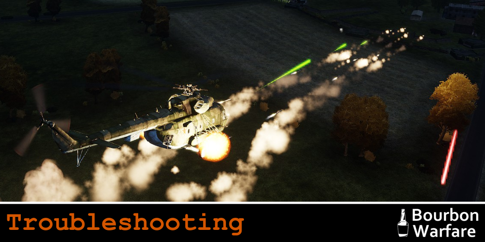<figcaption></figcaption></figure>

<details>

<summary>Troubleshooting</summary>

If you have followed this guide to its completion, then the hope is that you will not have any issues. That said, there are sometimes issues that we can't foresee. The following guide will help provide information that we will need to get any issues resolved.

***

Pabst Guide To Troubleshooting ArmA:\
work in progress\
\
**Big Three:**

1. Make sure mods are updated
2. Check what error message you're getting
3. Check RPT file (%localappdata%/Arma 3/)

**Why am I getting kicked?**\
1\. You are missing mods (missing something that the mission requires)\
2\. You have an extra mod mod not from our current modset (error message/local RPT will say "not signed by a key accepted by this server")\
3\. You have modified pbos that don't match the .bisign (won't say anything locally, but server will show message "Wrong signature for file")\
\
**How do I check my RPT file?**\
Hit WindowsKey+R and type in %localappdata%/Arma 3/\
That should take you to something like C:\Users\SomeAsshole\AppData\Local\Arma 3\\\
Sort by Date Modified and open the most recent or pick the most recent name.\
I recommend notepad++, but you should be able to "open with" any text program.\
\
**What should I look for in my RPT?**\
Recent Events will be at the bottom of the log.\
If you just got kicked, reopen the logfile and go to the bottom.

**What do I do when I find the mod that's the issue?**\
Simply right-click the item in the ARMA 3 Launcher and click "Repair". It will verify that you are running the latest version of the mod and download the newest version if not.&#x20;

</details>

<figure>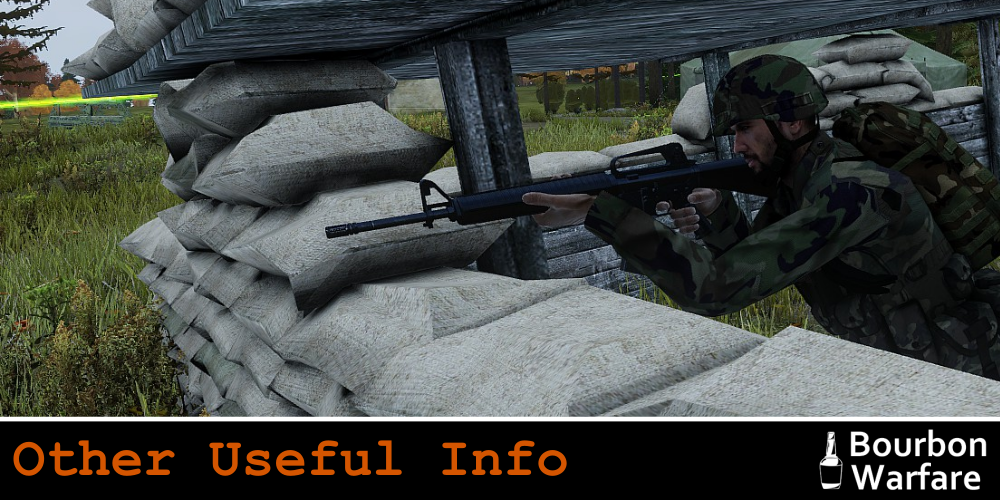<figcaption></figcaption></figure>

<details>

<summary>Other Useful Info</summary>

JIP Timeline Guide (click to expand):


</details>

[^1]: _Sometimes we are a little bit behind on updating TS as it can cause issues with ACRE. Use whatever version is linked here and if prompted to update DON’T. We will update the community as a whole when have had a chance to test that it isn’t going to cause issues._
